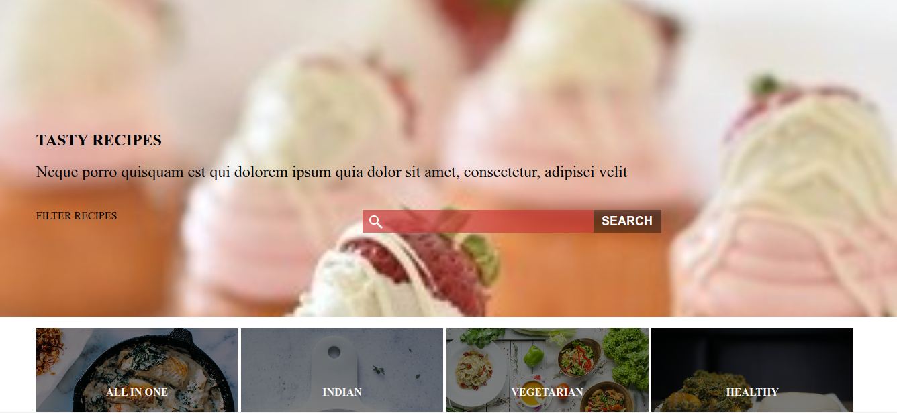

# Recipe app

Users should be able to:

- See a list of recipes on the homepage
- Search for a recipe on the homepage
- Click on the details button and see the recipe detail clicked

## Screenshot

## Live link

- Live Site URL: [Live link](https://recipe-app-six-blush.vercel.app/)

## Built with

- Mobile-first workflow
- [React](https://reactjs.org/) - JS library
- API

## Requirements
- Install Node/NPM package in your computer

## Running the project

- `git clone https://github.com/Michael-Otieno/recipe-app`
- In the project directory, run `npm i`
- In the project directory, run npm start to start the project
- Open http://localhost:3000 to view it in your browser.

## Further help
- Filter recipes by tags
- Feel free to fork and initiate changes that may improve the site.
- For any assistances, contact m.otieno205@gmail.com.

## Acknowledgments
- Rapid API

## MIT Licence
Copyright (c) 2020 Michael Otieno

Permission is hereby granted, free of charge, to any person obtaining a copy of this software and associated documentation files (the "Software"), to deal in the Software without restriction, including without limitation the rights to use, copy, modify, merge, publish, distribute, sublicense, and/or sell copies of the Software, and to permit persons to whom the Software is furnished to do so, subject to the following conditions:

The above copyright notice and this permission notice shall be included in all copies or substantial portions of the Software.

*Translation: Ofcourse you can use this for you project! Just make sure to say where you got this from :)

THE SOFTWARE IS PROVIDED "AS IS", WITHOUT WARRANTY OF ANY KIND, EXPRESS OR IMPLIED, INCLUDING BUT NOT LIMITED TO THE WARRANTIES OF MERCHANTABILITY, FITNESS FOR A PARTICULAR PURPOSE AND NONINFRINGEMENT. IN NO EVENT SHALL THE AUTHORS OR COPYRIGHT HOLDERS BE LIABLE FOR ANY CLAIM, DAMAGES OR OTHER LIABILITY, WHETHER IN AN ACTION OF CONTRACT, TORT OR OTHERWISE, ARISING FROM, OUT OF OR IN CONNECTION WITH THE SOFTWARE OR THE USE OR OTHER DEALINGS IN THE SOFTWARE.

